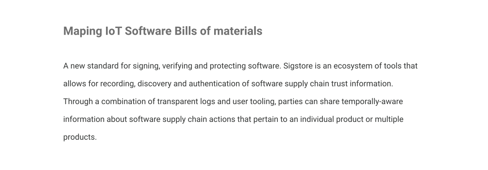
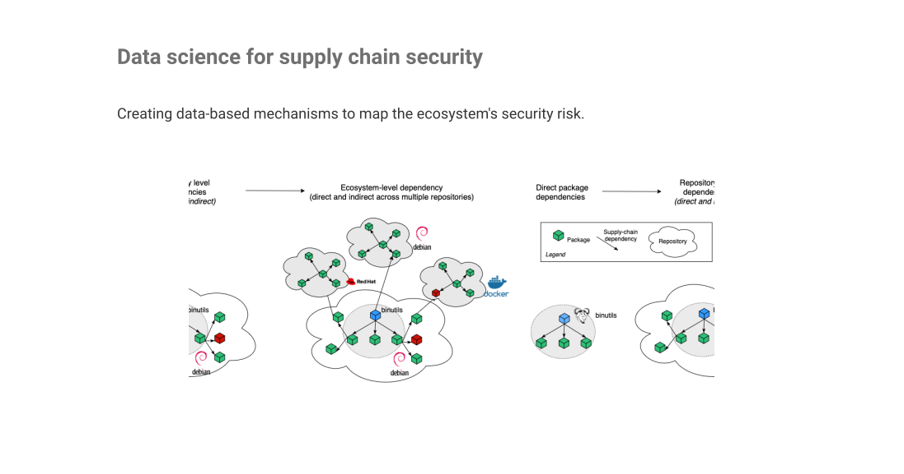
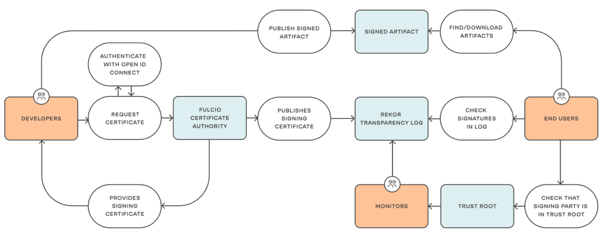
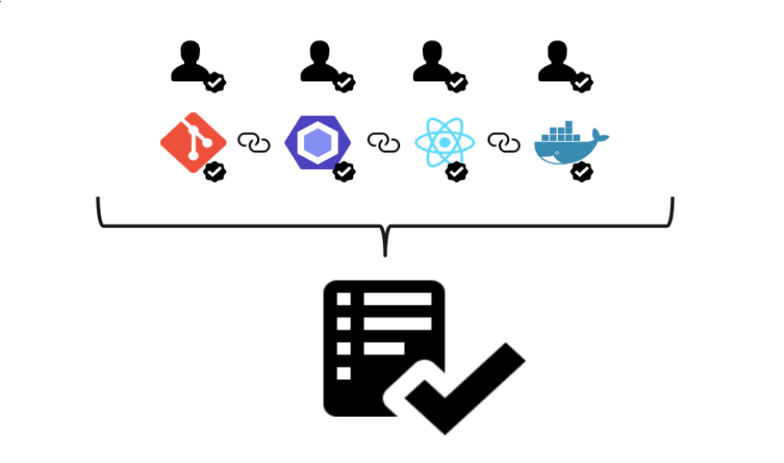
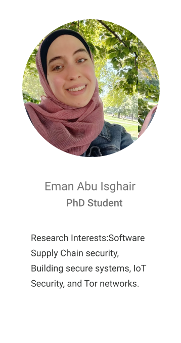

<!DOCTYPE html>
<html>
 
  
  <body style="margin: 0">
    <input type="hidden" id="anPageName" name="page" value="tslab" />
    

      

        
        

            
            

              To do so, we create systems such as in-toto to protect the software supply chain, develop new techniques
              to analyse software in the wild, and measure the software ecosystems and how they evolve.
            

            

              The Trustworthy Software Ecosystems lab at Purdue’s Electrical and Computer Engineering department focuses
              on analysing and protecting
            

        

        <!--
        

          

            
            <h1 class="title roboto-normal-white-70px">Projects</h1>
          

          

            
            
            
            

              
Sigstore

              

                A new standard for signing, verifying and protecting software. Sigstore is an ecosystem of tools that
                allows for recording, discovery and authentication of software supply chain trust information. Through a
                combination of transparent logs and user tooling, parties can share temporally-aware information about
                software supply chain actions that pertain to an individual product or multiple products.
              

              <a href="https://sigstore.dev/">
Read more
</a>
              
            

            

              
In-toto

              

                Cryptographically-verifiable supply chain security framework.In-toto is a framework that allows actors
                within the software supply chain to communicate their actions in a cryptographically verifiable fashion.
                Through in-toto, software consumers are able to identify the actions performed in the supply chain and
                compare them against a policy provided by an authoritative source. This policy language and the evidence
                capture tooling is expressive enough to represent most software supply chains, and can detect attempts
                to tamper with the integrity of the chain itself.
              

              <a href="https://in-toto.io/">
Read more
</a>
              
            

          

          

            
            
People

          

          

            
Students

            

              
              
              

                
                
Santiago Torres-Arias

                
Assistant Professor

                <a href="https://badhomb.re/"> 
Read more
</a>
              

              
              
              
              
Faculty

            

          

          

            
About the TSEL

            

              The Trustworthy Software Ecosystems Lab at Purdue University’s Electrical and Computer Engineering
              Department focuses on analyzing and securing the ecosystems in which software is developed, packaged,
              tested and distributed to users. We believe that protecting the environment in which software is created
              is as fundamental as the intrinsic security of the software itself. As such, we focus on studying aspects
              such as:
            

            

              

                

                  The software supply chain (from the version control system to the delivery pipeline).
                

                
              

              

                

                  The certification ecosystem (from code signing certificates to peer-to-peer authentication).
                

                
              

              

                
The developer identity and their community trust.

                
              

              

                

                  The societal interactions between developers on open source and its effect on code quality.
                

                
              

            

          
          

        

        

          

            
            
Publications

          

          

            
            
Conference Papers

            

              
              

                

                  “PolyPasswordHasher: Improving Password Storage Security”
                

                
                

                  S. Torres, J. Cappos. ;login: pages 18-21, December, 2014.
                

              

              
Magazine Articles

              

                

                  “Diplomat: Using Delegations to Protect Community Repositories.”
                

                
                

                  T. Kuppusamy, S. Torres-Arias, V. Diaz, J. Cappos. 13th USENIX Symposium on Networked Systems Design
                  and Implementation (NSDI ’16). Santa Clara, CA 2016.
                

              

              

                

                  “On Omitting Commits and Committing Omissions: Preventing Git Metadata Tampering That (Re)introduces Software Vulnerabilities.”
                

                
                

                  S. Torres-Arias, A. Ammula, R. Curtmola, J. Cappos. 25th USENIX Security Symposium (USENIX Security
                  ’16). Austin, TX 2016.
                

              

              

                

                  “Le-git-imate: Towards Verifiable Web-Based Git Repositories.”
                

                
                

                  H. Afzali, S. Torres-Arias, R. Curtmola, J. Cappos. 13th ACM ASIA Conference on Computer and
                  Communications Security (ACM ASIACCS ‘18). Songbdo, Incheon, Korea.
                

              

              

                

                  “Commit Signatures for Centralized Version Control Systems.”
                

                
                

                  S. Vaidya, S. Torres-Arias, R. Curtmola, and J Cappos. 34th ICT Systems Security and Privacy
                  Protection Conference (IFIP SEC ‘19). Lisbon, Portugal.
                

              

              

                

                  &#34;In-toto: providing farm-to-table security guarantees for bits and bytes.”
                

                
                

                  S. Torres-Arias, H. Afzali, T. K. Kuppusamy, R. Curtmola, J. Cappos. 28th USENIX Security Symposium
                  (USENIX Security ‘19) Santa Clara, CA 2019.
                

              

            

          

        

        

          

            
            
Talks and Media

          

        

        

          

            
            
            
JenkinsWorld &amp; DevOps World ‘19.

            
“Software Supply Chain Security”

          

          

            
            
            <a href="https://www.youtube.com/watch?v=ZIncgXrNnd8O">
Read more
</a>
            
DockerCon ‘19

            
“Open Source Summit: Security”

          

          

            
            
            <a href="https://www.youtube.com/watch?v=VSoPHK6BVMU">
Read more
</a>
            
(Demo) KubeCon &amp; Cloud-Native Con ‘18

            
“Deep Dive: SAFE BoF”

          

          

            
            
            <a href="https://www.youtube.com/watch?v=SNge7-t4JRE">
Read more
</a>
            
DockerCon ‘17

            

              “Securing the Software Supply Chain with TUF and Docker”
            

          

          

            
            
            <a href="https://www.youtube.com/watch?v=sCBgn0-JY8Q&t=10s">
Read more
</a>
            
Army Cyber Institute Cyber Talks ‘15

            
“PolyPasswordHasher: No Password Left Behind”

          

        

        
        
Blog

        

          

            
            
Trustworthy Software Ecosystems Lab

            
santiagotorres@purdue.edu

            

              <a href="#rectngulo-blanco-a">
About
</a>
              <a href="#transparencia-people">
People
</a>
              <a href="#transparencia-projects">
Projects
</a>
              <a href="#transparencia-publications">
Publications
</a>
              <a href="#transparencia-talks">
Talks and media
</a>
              <a href="#blog">
Blog
</a>
            

          

        
 -->
      

    

  </body>
</html>
